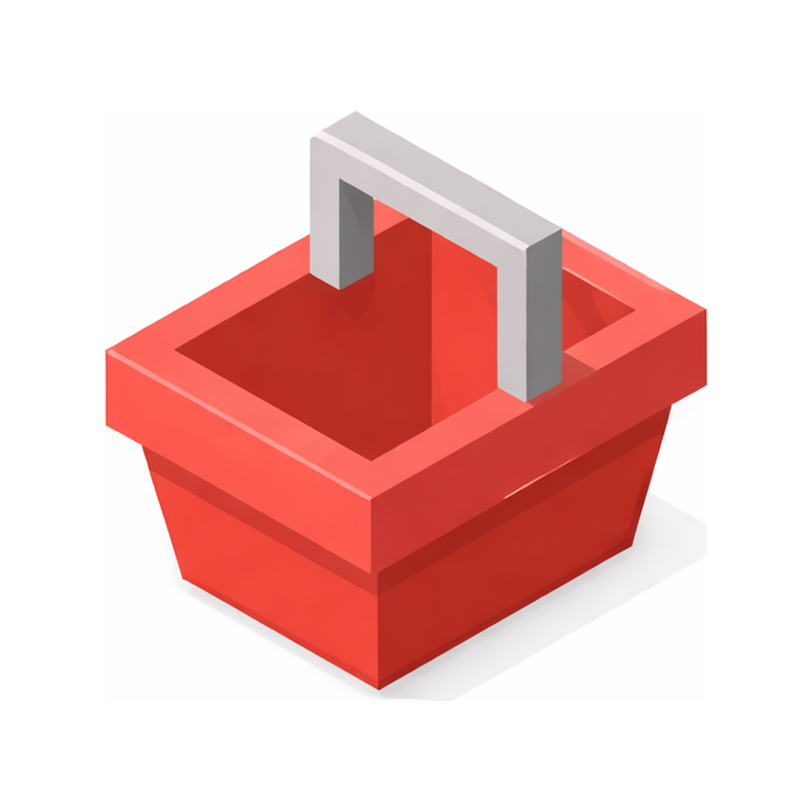
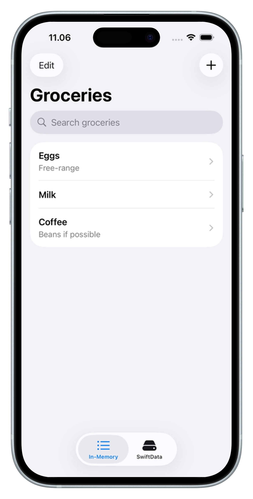
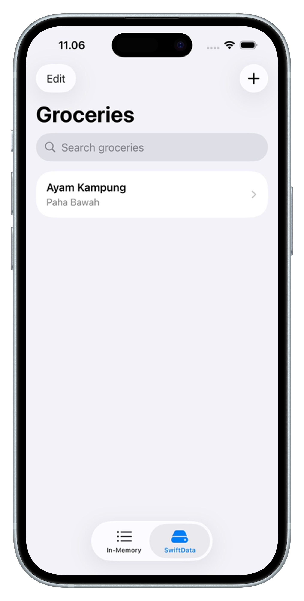
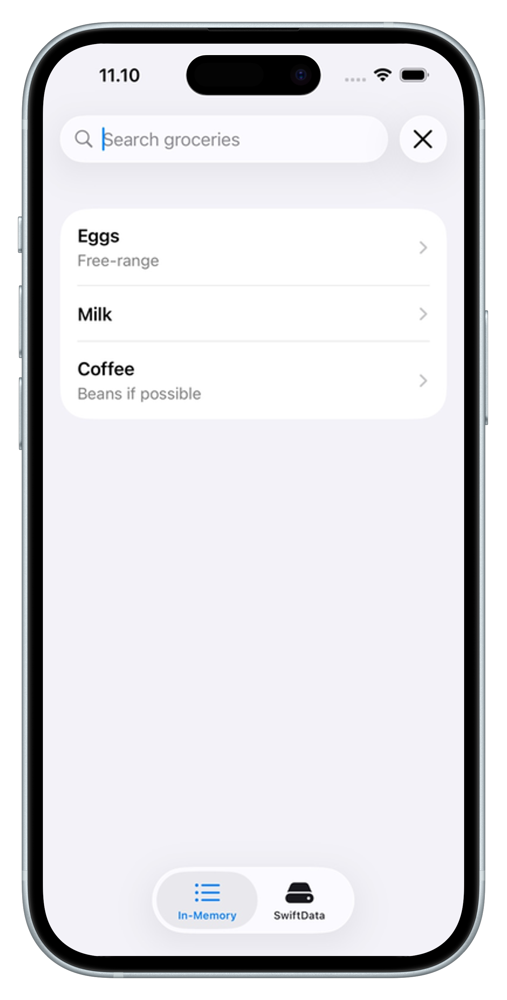
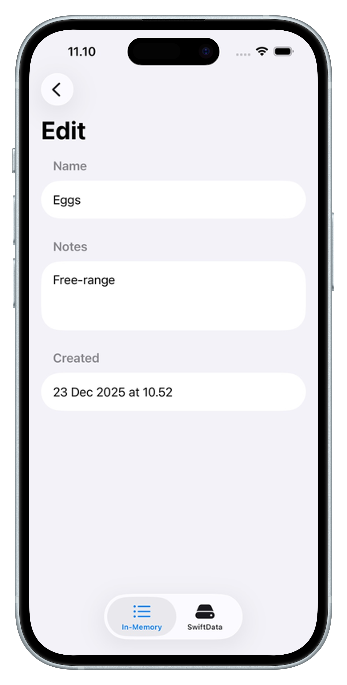
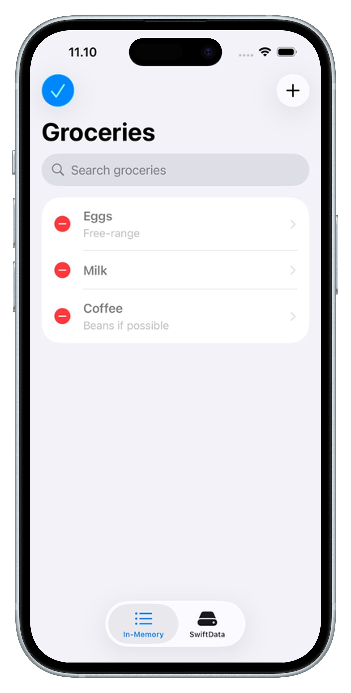

# Groceries (SwiftUI)

  

A tiny **SwiftUI iOS 17** sample app to learn the basics of building modern UI:
- **List + Navigation**
- **Add / Edit / Delete**
- **Search**
- Two implementations side-by-side:
  - **In-Memory (MVVM + Observation)**
  - **SwiftData persistence**

---

## Features

### In-Memory tab
- MVVM using **Observation** (`@Observable`)
- List → Edit screen
- Add item sheet
- Search + delete (works even while filtered)

### SwiftData tab
- Persistent storage using **SwiftData**
- `@Model`, `@Query`, `ModelContext`
- Add / edit / delete
- Search

---

## Screenshots

  
  
  

  
  

---

## Tech Stack
- **SwiftUI**
- **Observation** (iOS 17)
- **SwiftData** (iOS 17)

---

## Requirements
- Xcode 15+
- iOS 17+

---

## Getting Started
1. Clone the repo
2. Open the Xcode project
3. Run on an iOS 17+ simulator/device

---

## Project Structure (suggested)
- `Models/` – app models (in-memory + SwiftData `@Model`)
- `ViewModels/` – MVVM view models for the in-memory tab
- `Views/` – SwiftUI screens + components
